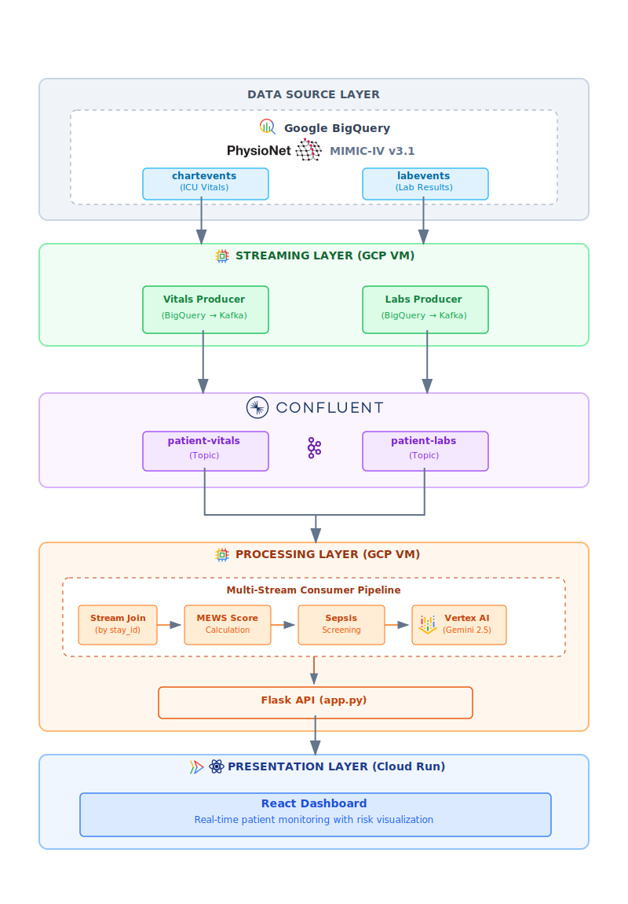

# Real-Time Patient Deterioration Prediction System


**AI Partner Catalyst Hackathon: Confluent Challenge**

*A real-time clinical decision support system that predicts patient deterioration using streaming vital signs and laboratory data, powered by Confluent Kafka, Google Cloud, and Vertex AI.*

## Table of Contents
- [Project Overview](#project-overview)
  - [The Challenge: Preventable In-Hospital Deterioration](#the-challenge-preventable-in-hospital-deterioration)
  - [Our Solution](#our-solution)
- [Architecture](#architecture)
- [Key Features](#key-features)
  - [1. Multi-Stream Processing with Confluent Kafka](#1-multi-stream-processing-with-confluent-kafka)
  - [2. Clinical Scoring (MEWS)](#2-clinical-scoring-mews)
  - [3. Zero-Shot LLM Advantage](#3-zero-shot-llm-advantage)
  - [4. Confidence-Aware AI Assessment](#4-confidence-aware-ai-assessment)
  - [5. Alert Fatigue Mitigation](#5-alert-fatigue-mitigation)
  - [6. Real-Time Dashboard](#6-real-time-dashboard)
- [Clinical Scoring Methodology](#clinical-scoring-methodology)
  - [MEWS Scoring Thresholds](#mews-scoring-thresholds)
- [Technology Stack](#technology-stack)
- [Dataset](#dataset)
  - [MIMIC-IV (PhysioNet)](#mimic-iv-physionet)
  - [Measurement Frequency (Real ICU Patterns)](#measurement-frequency-real-icu-patterns)
- [Local Development Setup](#local-development-setup)
  - [Prerequisites](#prerequisites)
  - [Backend Setup](#backend-setup)
  - [Frontend Setup](#frontend-setup)
  - [Running Locally](#running-locally)
- [Project Structure](#project-structure)
- [Background \& Clinical Rationale](#background--clinical-rationale)
  - [The "80%" Reality](#the-80-reality)
  - [The 6-8 Hour Window](#the-6-8-hour-window)
  - [Economic Impact](#economic-impact)
- [Future Enhancements](#future-enhancements)
- [Acknowledgments](#acknowledgments)
- [License](#license)
- [References](#references)


## Live Demo

| Component | URL |
|-----------|-----|
| **Dashboard** | [https://icu.ffli.dev](https://icu.ffli.dev) |
| **API** | [https://patient-deterioration-monitor.ffli.dev](https://patient-deterioration-monitor.ffli.dev) |

## Project Overview
This project addresses the critical "failure to rescue" gap in modern inpatient care. Despite the abundance of physiological data in hospitals, In-Hospital Cardiac Arrest (IHCA) remains a leading cause of preventable mortality. This system transitions monitoring from reactive, batch-based analysis to a Real-Time, Multimodal Streaming Intelligence platform capable of detecting patient deterioration hours before a critical event.

### The Challenge: Preventable In-Hospital Deterioration

- **80% of cardiac arrests** show warning signs 6-8 hours before the event (Schein et al., 1990)
- **Alert fatigue** plagues existing systems — positive predictive value (PPV) as low as 6% in some early warning systems (Hillman et al., 2001)
- **ICU costs significantly more** than ward care, with direct costs 6-7 times higher for ICU survivors (Hamilton et al., 1995)

### Our Solution

A streaming analytics platform that:
1. Ingests real-time vital signs and lab results via **Confluent Kafka**
2. Calculates validated clinical scores (MEWS) in real-time
3. Uses **Vertex AI Gemini** for zero-shot clinical interpretation
4. Reduces false alarms through trend-based alert confirmation
5. Provides confidence-aware AI assessments with uncertainty quantification

## Architecture




## Key Features

### 1. Multi-Stream Processing with Confluent Kafka

| Confluent Feature | Implementation |
|-------------------|----------------|
| **Multi-topic consumption** | Simultaneous vitals + labs streams |
| **Stream join by key** | Patient data combined by `stay_id` |
| **Temporal windowing** | Lab staleness detection (>4hr threshold) |
| **Real-time enrichment** | Sepsis screening across data streams |

### 2. Clinical Scoring (MEWS)

Modified Early Warning Score calculation with risk stratification:

| MEWS Score | Risk Level | Response |
|------------|------------|----------|
| 0-1 | LOW | Routine monitoring |
| 2-3 | MEDIUM | Increased observation |
| 4-5 | HIGH | Urgent clinical review |
| ≥6 | CRITICAL | Immediate intervention |

> See [Clinical Scoring Methodology](#clinical-scoring-methodology) section for details on our modified scoring protocol.

### 3. Zero-Shot LLM Advantage

**Key Differentiator**: No training data required.

- Leverages Gemini's pre-existing medical knowledge
- Interpretable natural language outputs
- Faster deployment than traditional ML pipelines
- More generalizable across patient populations

### 4. Confidence-Aware AI Assessment

The system provides transparent uncertainty quantification. Example Output:
```
AI Assessment (Confidence: 🟡 MEDIUM):
  The patient presents with severe hypotension and multi-organ 
  dysfunction, including acute kidney injury...
  
  📋 Concerns: Hypotensive shock, Severe anemia, AKI
  💊 Actions: Urgent medical evaluation, Stat repeat labs
  
  ⚠️ While vital sign data is incomplete (3/7) and lab results 
  are ~24 hours old, the combined picture strongly indicates 
  a critical clinical scenario.
```

### 5. Alert Fatigue Mitigation

**Problem**: Traditional systems have PPV as low as 6%

**Our Solution**: Trend-based confirmation
- Require 2+ consecutive elevated readings within 5 minutes
- Prevents false alarms from transient spikes
- Maintains sensitivity while improving specificity

### 6. Real-Time Dashboard

- Live patient monitoring with risk-sorted display
- Search and filter by patient ID, risk level, confidence
- Pagination for managing large patient populations (500 patients)
- Interactive trend charts with historical data
- Alert feed with acknowledgment workflow

## Clinical Scoring Methodology

This system implements a **Modified MEWS with SpO2**, combining:

1. **Core MEWS parameters** (Subbe et al., 2001): Heart rate, respiratory rate, 
   systolic blood pressure, and temperature thresholds
   - Original 5-parameter score: HR, RR, SBP, Temperature, AVPU
   - MEWS ≥5 associated with increased mortality (OR 5.4) and ICU admission (OR 10.9)

2. **SpO2 scoring** (Prytherch et al., 2010 — ViEWS): Oxygen saturation thresholds 
   adapted from the VitalPAC Early Warning Score
   - AUROC 0.888 for 24-hour mortality prediction
   - Basis for UK National Early Warning Score (NEWS)

This hybrid approach is appropriate for ICU monitoring where continuous SpO2 data is available, enhancing the original MEWS with respiratory status assessment.

### MEWS Scoring Thresholds

| Parameter | Score 3 | Score 2 | Score 1 | Score 0 | Score 1 | Score 2 | Score 3 |
|-----------|:-------:|:-------:|:-------:|:-------:|:-------:|:-------:|:-------:|
| **RR** (/min) | — | <9 | — | 9–14 | 15–20 | 21–29 | ≥30 |
| **HR** (bpm) | — | ≤40 | 41–50 | 51–100 | 101–110 | 111–129 | ≥130 |
| **SBP** (mmHg) | ≤70 | 71–80 | 81–100 | 101–199 | — | ≥200 | — |
| **Temp** (°C) | — | <35 | — | 35–38.4 | — | ≥38.5 | — |
| **SpO2** (%)\* | ≤91 | 92–93 | 94–95 | ≥96 | — | — | — |

\*SpO2 scoring based on ViEWS (Prytherch et al., 2010)

## Technology Stack

| Component | Technology |
|-----------|------------|
| **Streaming Platform** | Confluent Cloud (Apache Kafka) |
| **AI/ML** | Google Cloud Vertex AI (Gemini 2.5 Flash) |
| **Compute** | Google Compute Engine (GCE) |
| **Frontend Hosting** | Google Cloud Run |
| **Load Balancing** | GCP Load Balancer + Managed SSL |
| **Backend API** | Python Flask + Flask-CORS |
| **Frontend** | React + TypeScript + Tailwind CSS + Recharts |
| **Data Source** | MIMIC-IV (via BigQuery) |


## Dataset

### MIMIC-IV (PhysioNet)
Real de-identified ICU patient data from Beth Israel Deaconess Medical Center (Johnson et al., 2023).

**Vital Signs (266K records, 500 patients)**
- Heart Rate, Respiratory Rate, SpO2
- Systolic BP, Diastolic BP
- Temperature

**Laboratory Results (25K records)**
- Lactate (sepsis marker)
- Creatinine (kidney function)  
- WBC (infection indicator)
- Potassium (electrolyte balance)

### Measurement Frequency (Real ICU Patterns)

| Vital | Frequency | Method |
|-------|-----------|--------|
| HR, SpO2 | Continuous | Bedside monitor |
| Respiratory Rate | Frequent | Monitor/manual |
| Blood Pressure | 15-60 min | Cuff/arterial line |
| Temperature | 2-4 hours | Manual |

## Local Development Setup

### Prerequisites
- Python 3.11+
- Node.js 18+
- Confluent Cloud account
- Google Cloud account with Vertex AI enabled
- MIMIC-IV BigQuery access (PhysioNet credentialing required)

### Backend Setup

```bash
# Clone repository
git clone https://github.com/ff98li/patient-deterioration-monitor.git
cd patient-deterioration-monitor

# Create virtual environment
python3.11 -m venv venv
source venv/bin/activate

# Install dependencies
pip install -r requirements.txt

# Configure credentials
cp config.example.py config.py
# Edit config.py with your Confluent and GCP credentials
```

### Frontend Setup

```bash
cd dashboard
npm install
```

### Running Locally

```bash
# Terminal 1: Consumer + API
python run_combined.py

# Terminal 2: Vitals Producer
python vitals_producer_continuous.py

# Terminal 3: Labs Producer
python lab_producer_continuous.py

# Terminal 4: Dashboard (development)
cd dashboard
npm run dev
```

Access dashboard at: `http://localhost:3000`

## Project Structure

```
patient-deterioration-monitor/
├── config.example.py              # Configuration template
├── run_combined.py                # Combined consumer + API server
├── vitals_producer_continuous.py  # BigQuery-based Vital signs Kafka producer
├── lab_producer_continuous.py     # BigQuery-based Lab results Kafka producer
├── consumer_multistream.py        # Multi-stream Kafka consumer
├── model.py                       # MEWS calculation & Vertex AI integration
├── lab_analysis.py                # Lab analysis & sepsis screening
├── dashboard_api.py               # Flask REST API
├── shared_state.py                # Thread-safe state management
├── requirements.txt               # Python dependencies
│
├── dashboard/                     # React Frontend
│   ├── App.tsx                    # Main application component
│   ├── components/
│   │   ├── PatientCard.tsx        # Patient summary card
│   │   ├── PatientDetailModal.tsx # Detailed patient view
│   │   ├── AlertFeed.tsx          # Real-time alerts
│   │   ├── RiskChart.tsx          # Risk distribution chart
│   │   └── StatCard.tsx           # Statistics cards
│   ├── services/
│   │   └── apiService.ts          # API client
│   ├── Dockerfile                 # Cloud Run deployment
│   └── nginx.conf                 # Nginx configuration
│
└── BigQuery/                      # SQL extraction scripts
    ├── extract_vitals.sql
    └── extract_labs.sql
```

## Background & Clinical Rationale
### The "80%" Reality
Current clinical literature establishes that cardiac arrest is rarely a sudden, unpredictable event. Research consistently demonstrates that 80% of in-hospital cardiac arrests are preceded by identifiable physiological warning signs, known as clinical antecedents (Schein et al., 1990). These signs typically manifest as progressive instability in respiratory rate, heart rate, or blood pressure, often occurring alongside subtle changes in mental status (Hillman et al., 2001).

### The 6-8 Hour Window
Crucially, these warning signs are detectable for an average of 6 to 8 hours prior to the terminal event (Schein et al., 1990; Hillman et al., 2001). This creates a significant "window of opportunity" for early intervention. However, traditional intermittent nursing checks (typically every 4-8 hours) frequently miss this window, leading to reactive "Code Blue" responses rather than proactive care (Kwon et al., 2018).

### Economic Impact
The cost of missing this window is severe. Intensive Care Unit (ICU) transfers triggered by late-stage deterioration are significantly more expensive than early interventions delivered on the ward. Studies indicate that the direct costs per day for ICU survivors can be 6 to 7 times higher than for non-ICU care (Hamilton et al., 1995). Furthermore, complications arising from delayed detection, such as Acute Kidney Injury (AKI) or hospital-acquired infections, can increase mortality risk by 3-5 times and add substantially to the cost per episode (Observe Medical, 2021). By preventing unplanned ICU admissions, this system aims to reduce length of stay and alleviate capacity constraints ("bed blocking").


## Future Enhancements

1. **MIMIC-CXR Integration**: Chest X-ray analysis for respiratory deterioration
2. **Nursing Notes**: Unstructured text analysis for subtle clinical cues
3. **ECG Morphology**: QT interval, ST elevation detection
4. **Federated Learning**: Multi-hospital deployment without data sharing
5. **Alert Acknowledgment**: Clinician feedback loop for continuous improvement

## Acknowledgments

- **MIMIC-IV Dataset** — PhysioNet / Beth Israel Deaconess Medical Center
- **Confluent** — Streaming infrastructure and hackathon sponsorship
- **Google Cloud** — Vertex AI platform and cloud infrastructure

## License

MIT License. See [LICENSE](LICENSE) file for details.

## References

Hamilton, S., Mion, L. C., & DePew, D. D. (1995). ICU and non-ICU cost per day. *Canadian Journal of Anaesthesia, 42*(3), 192–196. https://doi.org/10.1007/BF03010674

Hillman, K., Bristow, P., Chey, T., Daffurn, K., Jacques, T., Norman, S., Bishop, G., & Simmons, G. (2001). Antecedents to hospital deaths. *Internal Medicine Journal, 31*(6), 343–348. https://doi.org/10.1046/j.1445-5994.2001.00077.x

Johnson, A. E. W., Bulgarelli, L., Shen, L., Gayles, A., Shammber, A., Horng, S., Pollard, T. J., Hao, S., Moody, B., Gow, B., Lehman, L.-W. H., Celi, L. A., & Mark, R. G. (2023). MIMIC-IV, a freely accessible electronic health record dataset. *Scientific Data, 10*, Article 1. https://doi.org/10.1038/s41597-022-01899-x

Kwon, J. M., Lee, Y., Lee, Y., Lee, S., & Park, J. (2018). An algorithm based on deep learning for predicting in-hospital cardiac arrest. *Journal of the American Heart Association, 7*(13), Article e008678. https://doi.org/10.1161/JAHA.118.008678

Observe Medical ASA. (2021). *Third quarter 2021 presentation*. Observe Medical Investor Relations.

Prytherch, D. R., Smith, G. B., Schmidt, P. E., & Featherstone, P. I. (2010). ViEWS—Towards a national early warning score for detecting adult inpatient deterioration. *Resuscitation, 81*(8), 932–937. https://doi.org/10.1016/j.resuscitation.2010.04.014

Schein, R. M., Hazday, N., Pena, M., Ruben, B. H., & Sprung, C. L. (1990). Clinical antecedents to in-hospital cardiopulmonary arrest. *Chest, 98*(6), 1388–1392. https://doi.org/10.1378/chest.98.6.1388

Subbe, C. P., Kruger, M., Rutherford, P., & Gemmel, L. (2001). Validation of a modified Early Warning Score in medical admissions. *QJM: An International Journal of Medicine, 94*(10), 521–526. https://doi.org/10.1093/qjmed/94.10.521